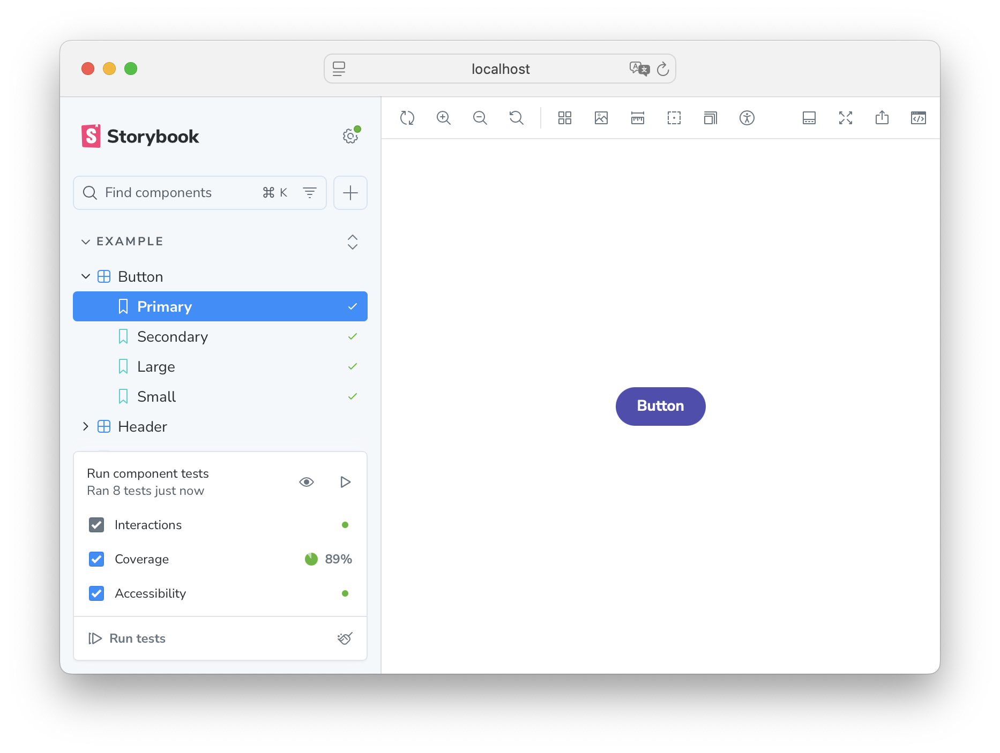

# Migrate from Storybook test-runner to the Storybook Vitest integration

The Storybook test-runner was created back in 2021 to enable users to run stories as tests. It is a solution which uses Jest as runner and Playwright as browser environment. Over the years, Storybook has evolved and introduced many testing related concepts, including a [Vitest-based testing solution](https://storybook.js.org/docs/writing-tests/integrations/vitest-addon), a spiritual successor to the Storybook test-runner. Alongside it we released a testing widget, allowing users to run tests directly from Storybook's UI and get reports such as a11y and coverage.



This guide explains how to migrate an existing project using `@storybook/test-runner` to the Vitest addon.

### Is my project eligible to upgrade?

This migration is no-brainer for projects which use Vite. If your Storybook uses other builders such as Webpack or RsPack, it's advised to keep using the `@storybook/test-runner`.

## Migration steps

Below you will find steps on the migration, and alongside it you can use [this commit as reference](https://github.com/yannbf/test-runner-migration-example/commit/cb0ddd5137021a7ed25d15f8d23c6c5e2d01513e) as an example of project being migrated.

### 1) Remove test-runner dependencies

Remove the following dependencies:

- `@storybook/test-runner` dependency
- `@storybook/addon-coverage` dependency if present

### 2) Remove test-runner related files

Remove the following files:

- `test-runner-jest.config.js` file if present
- `.storybook/test-runner.ts` file if present
  - If you're using it for a11y testing, this is now done out of the box with the Vitest addon.
  - If you're using it for image snapshot testing, check [this section here](#what-if-i-am-doing-image-snapshot-testing).
  - If you're using it for custom, advanced use cases such as using [the `prepare` hook](https://github.com/storybookjs/test-runner#prepare), reach out on discord or open a [discussion on GitHub](https://github.com/storybookjs/storybook/discussions/new/choose) so we can assist you with the migration.

### 3) Set up `@storybook/addon-vitest`

- Run `npx storybook add @storybook/addon-vitest` which will set up all the necessary code for you.
- Visit [this page](https://storybook.js.org/docs/writing-tests/integrations/vitest-addon#install-and-set-up) for more detail on what it does
- Update the package.json script for Storybook tests, replacing the test-runner binary and using Vitest instead:

```diff
{
  "scripts": {
-    "test-storybook": "test-storybook"
+    "test-storybook": "vitest --project=storybook"
  }
}
```

Tip:

1. If you previously used `--coverage` with the test-runner, use Vitest’s coverage instead: `vitest --project=storybook --coverage`.
2. Add more browsers by extending `instances` field in the Vitest configuration file (e.g., `firefox`, `webkit`).

### 4) Update your CI to run Vitest instead of the test-runner

If you're using the Storybook test-runner in CI, replace its build/serve/wait flow with a single Vitest command.

```diff
# .github/workflows/storybook-tests.yml
name: 'Storybook Tests'

on: push

jobs:
  test:
    timeout-minutes: 60
    runs-on: ubuntu-latest
    steps:
      - uses: actions/checkout@v4
      - uses: actions/setup-node@v4
        with:
          node-version-file: '.nvmrc'
      - name: Install dependencies
        run: yarn
      - name: Install Playwright
        run: npx playwright install --with-deps
-      - name: Build Storybook
-        run: yarn build-storybook --quiet
-      - name: Serve Storybook and run tests
-        run: |
-          npx concurrently -k -s first -n "SB,TEST" -c "magenta,blue" \
-            "npx http-server storybook-static --port 6006 --silent" \
-            "npx wait-on tcp:127.0.0.1:6006 && yarn test-storybook --coverage"
+      - name: Run storybook tests
+        run: |
+          npx vitest --project=storybook
```

If you want coverage in CI, use:

```bash
npx vitest --project=storybook --coverage
```

## Conclusion

Now you should be able to run you story tests through:

- The testing widget in Storybook's UI
- Vitest CLI
- [Vitest IDE integrations](https://vitest.dev/guide/ide)

If you're wondering what else changed compared to the test-runner, here's a condensed list:

- Vitest is used as a runner instead of Jest, which modernizes your codebase and executes tests much faster.
- Stories seamlessly integrate as tests in your Vitest setup, simplifying your configuration by a lot.
- There is no need to build and run Storybook to run tests, which makes the set up faster and more portable.
- Tests are still tested in a Playwright environment, but in [Vitest's Browser mode](https://vitest.dev/guide/browser/).
- A11y testing comes out of the box and integrate with the Storybook testing widget and a11y addon panel.
- Code coverage comes out of the box and does not require instrumentation from the `@storybook/addon-coverage` package which makes your stories render faster.

## FAQ

### What if I am using Storybook with Webpack or RsPack?

In this case, it's advised to keep using the `@storybook/test-runner`.

### What if I am using Jest for my unit tests?

You can still migrate to use Vitest, but if you believe that you won't benefit from that, you can keep using the `@storybook/test-runner`..

### What if I am doing image snapshot testing?

There are solutions for image snapshot testing that integrate with the Storybook testing widget:

- Locally with [`storybook-addon-vis`](https://github.com/repobuddy/visual-testing)
- On the cloud with [`@chromatic-com/visual-tests-addon`](https://github.com/chromaui/addon-visual-tests)
