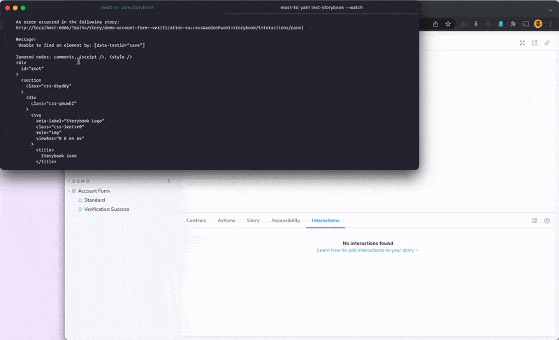
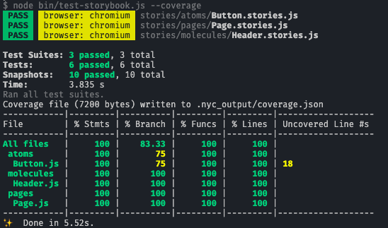
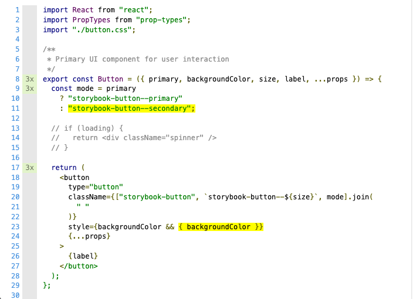

<h1>Storybook Test Runner</h1>

Storybook test runner turns all of your stories into executable tests.

<h2>Table of Contents</h2>

- [Features](#features)
- [How it works](#how-it-works)
- [Getting started](#getting-started)
  - [Jest compatibility](#jest-compatibility)
- [CLI Options](#cli-options)
- [Configuration](#configuration)
- [Running against a deployed Storybook](#running-against-a-deployed-storybook)
  - [Index.json mode](#indexjson-mode)
- [Running in CI](#running-in-ci)
  - [1. Running against deployed Storybooks on Github Actions deployment](#1-running-against-deployed-storybooks-on-github-actions-deployment)
  - [2. Running against locally built Storybooks in CI](#2-running-against-locally-built-storybooks-in-ci)
- [Setting up code coverage](#setting-up-code-coverage)
  - [1 - Instrument the code](#1---instrument-the-code)
    - [Using @storybook/addon-coverage](#using-storybookaddon-coverage)
    - [Manually configuring istanbul](#manually-configuring-istanbul)
  - [2 - Run tests with --coverage flag](#2---run-tests-with---coverage-flag)
  - [3 - Merging code coverage with coverage from other tools](#3---merging-code-coverage-with-coverage-from-other-tools)
- [Experimental test hook API](#experimental-test-hook-api)
  - [DOM snapshot recipe](#dom-snapshot-recipe)
  - [Image snapshot recipe](#image-snapshot-recipe)
  - [Render lifecycle](#render-lifecycle)
  - [Global utility functions](#global-utility-functions)
- [Troubleshooting](#troubleshooting)
  - [The error output in the CLI is too short](#the-error-output-in-the-cli-is-too-short)
  - [The test runner seems flaky and keeps timing out](#the-test-runner-seems-flaky-and-keeps-timing-out)
  - [The test runner reports "No tests found" running on a Windows CI](#the-test-runner-reports-no-tests-found-running-on-a-windows-ci)
  - [Adding the test runner to other CI environments](#adding-the-test-runner-to-other-ci-environments)
- [Future work](#future-work)

## Features

- ⚡️ Zero config setup
- 💨 Smoke test all stories
- ▶️ Test stories with play functions
- 🏃 Test your stories in parallel in a headless browser
- 👷 Get feedback from error with a link directly to the story
- 🐛 Debug them visually and interactively in a live browser with [addon-interactions](https://storybook.js.org/docs/react/essentials/interactions)
- 🎭 Powered by [Jest](https://jestjs.io/) and [Playwright](https://playwright.dev/)
- 👀 Watch mode, filters, and the conveniences you'd expect
- 📔 Code coverage reports

## How it works

See the announcement of Interaction Testing with Storybook in detail in [this blog post](https://storybook.js.org/blog/interaction-testing-with-storybook/) or watch [this video](https://www.youtube.com/watch?v=Ex52FHKyc7E&ab_channel=Storybook) to see it in action.

The Storybook test runner uses Jest as a runner, and Playwright as a testing framework. Each one of your `.stories` files is transformed into a spec file, and each story becomes a test, which is run in a headless browser.

The test runner is simple in design – it just visits each story from a running Storybook instance and makes sure the component is not failing:

- For stories without a `play` function, it verifies whether the story rendered without any errors. This is essentially a smoke test.
- For those with a `play` function, it also checks for errors in the `play` function and that all assertions passed. This is essentially an [interaction test](https://storybook.js.org/docs/react/writing-tests/interaction-testing#write-an-interaction-test).

If there are any failures, the test runner will provide an output with the error, alongside with a link to the failing story, so you can see the error yourself and debug it directly in the browser:



## Getting started

1. Install the test runner:

```jsx
yarn add @storybook/test-runner -D
```

2. Add a `test-storybook` script to your package.json

```json
{
  "scripts": {
    "test-storybook": "test-storybook"
  }
}
```

3. Optionally, follow [the documentation](https://storybook.js.org/docs/react/writing-tests/interaction-testing#set-up-the-interactions-addon) for writing interaction tests and using [addon-interactions](https://storybook.js.org/addons/@storybook/addon-interactions/) to visualize the interactions with an interactive debugger in Storybook.

4. Run Storybook (the test runner runs against a running Storybook instance):

```jsx
yarn storybook
```

5. Run the test runner:

```jsx
yarn test-storybook
```

> **NOTE:** The runner assumes that your Storybook is running on port `6006`. If you're running Storybook in another port, either use --url or set the TARGET_URL before running your command like:
>
> ```jsx
> yarn test-storybook --url http://localhost:9009
> or
> TARGET_URL=http://localhost:9009 yarn test-storybook
> ```

### Jest compatibility

The Storybook test runner comes with Jest installed as an internal dependency. In case you are also using Jest as a dependency in your project, in order to avoid possible conflicts, you should use a compatible version of the test runner.

| Jest version | Test runner version |
| ------------ | ------------------- |
| ^26.6.3      | ^0.6.2              |
| ^27.0.0      | ^0.6.2              |
| ^28.0.0      | ^0.7.0 and higher   |

## CLI Options

```plaintext
Usage: test-storybook [options]
```

| Options                         | Description                                                                                                                          |
| ------------------------------- | ------------------------------------------------------------------------------------------------------------------------------------ |
| `--help`                        | Output usage information <br/>`test-storybook --help`                                                                                |
| `-i`, `--index-json`            | Run in index json mode. Automatically detected (requires a compatible Storybook) <br/>`test-storybook --index-json`                  |
| `--no-index-json`               | Disables index json mode <br/>`test-storybook --no-index-json`                                                                       |
| `-c`, `--config-dir [dir-name]` | Directory where to load Storybook configurations from <br/>`test-storybook -c .storybook`                                            |
| `--watch`                       | Watch files for changes and rerun tests related to changed files.<br/>`test-storybook --watch`                                       |
| `--watchAll`                    | Watch files for changes and rerun all tests when something changes.<br/>`test-storybook --watchAll`                                  |
| `--coverage`                    | Indicates that test coverage information should be collected and reported in the output <br/>`test-storybook --coverage`             |
| `--url`                         | Define the URL to run tests in. Useful for custom Storybook URLs <br/>`test-storybook --url http://the-storybook-url-here.com`       |
| `--browsers`                    | Define browsers to run tests in. One or multiple of: chromium, firefox, webkit <br/>`test-storybook --browsers firefox chromium`     |
| `--maxWorkers [amount]`         | Specifies the maximum number of workers the worker-pool will spawn for running tests <br/>`test-storybook --maxWorkers=2`            |
| `--no-cache`                    | Disable the cache <br/>`test-storybook --no-cache`                                                                                   |
| `--clearCache`                  | Deletes the Jest cache directory and then exits without running tests <br/>`test-storybook --clearCache`                             |
| `--verbose`                     | Display individual test results with the test suite hierarchy <br/>`test-storybook --verbose`                                        |
| `-u`, `--updateSnapshot`        | Use this flag to re-record every snapshot that fails during this test run <br/>`test-storybook -u`                                   |
| `--eject`                       | Creates a local configuration file to override defaults of the test-runner <br/>`test-storybook --eject`                             |
| `--json`                        | Prints the test results in JSON. This mode will send all other test output and user messages to stderr. <br/>`test-storybook --json` |
| `--outputFile`                  | Write test results to a file when the --json option is also specified. <br/>`test-storybook --json --outputFile results.json`        |

## Configuration

The test runner is based on [Jest](https://jestjs.io/) and will accept most of the [CLI options](https://jestjs.io/docs/cli) that Jest does, like `--watch`, `--watchAll`, `--maxWorkers`, etc.

The test runner works out of the box, but if you want better control over its configuration, you can run `test-storybook --eject` to create a local `test-runner-jest.config.js` file in the root folder of your project, which will be used by the test runner.

The test runner uses [jest-playwright](https://github.com/playwright-community/jest-playwright) and you can pass [testEnvironmentOptions](https://github.com/playwright-community/jest-playwright#configuration) to further configure it, such as how it's done above to run tests against all browsers instead of just chromium. For this you must eject the test runner configuration.

> **NOTE:** The Jest options relate to the version of Jest that come in the test runner. You can check the [Jest compatibility table](#jest-compatibility) for reference.

## Running against a deployed Storybook

By default, the test runner assumes that you're running it against a locally served Storybook on port 6006.
If you want to define a target url so it runs against deployed Storybooks, you can do so by passing the `TARGET_URL` environment variable:

```bash
TARGET_URL=https://the-storybook-url-here.com yarn test-storybook
```

Or by using the `--url` flag:

```bash
yarn test-storybook --url https://the-storybook-url-here.com
```

### Index.json mode

By default, the test runner transforms your story files into tests. It also supports a secondary "index.json mode" which runs directly against your Storybook's index data, which dependending on your Storybook version is located in a `stories.json` or `index.json`, a static index of all the stories.

This is particularly useful for running against a deployed storybook because `index.json` is guaranteed to be in sync with the Storybook you are testing. In the default, story file-based mode, your local story files may be out of sync – or you might not even have access to the source code. Furthermore, it is not possible to run the test-runner directly against `.mdx` stories, and `index.json` mode must be used.

<!-- TODO: switch details to 6.4 once Storybook 7.0 becomes default -->

<details>
<summary>If you're using Storybook 7.0</summary>

To run in `index.json` mode, first make sure your Storybook has a v4 `index.json` file. You can find it when navigating to:

```
https://your-storybook-url-here.com/index.json
```

It should be a JSON file and the first key should be `"v": 4` followed by a key called `"entries"` containing a map of story IDs to JSON objects.

In Storybok 7.0, `index.json` is enabled by default, unless you are using the `storiesOf()` syntax, in which case it is not supported.

</details>

On Storybook 6.4 and 6.5, to run in `index.json` mode, first make sure your Storybook has a file called `stories.json` that has `"v": 3`, available at:

```
https://your-storybook-url-here.com/stories.json
```

If your Storybook does not have a `stories.json` file, you can generate one, provided:

- You are running Storybook 6.4 or above
- You are not using `storiesOf` stories

To enable `stories.json` in your Storybook, set the `buildStoriesJson` feature flag in `.storybook/main.js`:

```js
module.exports = {
  features: { buildStoriesJson: true },
};
```

Once you have a valid `stories.json` file, your Storybook will be compatible with the "index.json mode".

By default, the test runner will detect whether your Storybook URL is local or remote, and if it is remote, it will run in "index.json mode" automatically. To disable it, you can pass the `--no-index-json` flag:

```bash
yarn test-storybook --no-index-json
```

If you are running tests against a local Storybook but for some reason want to run in "index.json mode", you can pass the `--index-json` flag:

```bash
yarn test-storybook --index-json
```

> **NOTE:** index.json mode is not compatible with watch mode.

## Running in CI

If you want to add the test-runner to CI, there are a couple of ways to do so:

### 1. Running against deployed Storybooks on Github Actions deployment

On Github actions, once services like Vercel, Netlify and others do deployment runs, they follow a pattern of emitting a `deployment_status` event containing the newly generated URL under `deployment_status.target_url`. You can use that URL and set it as `TARGET_URL` for the test-runner.

Here's an example of an action to run tests based on that:

```yml
name: Storybook Tests
on: deployment_status
jobs:
  test:
    timeout-minutes: 60
    runs-on: ubuntu-latest
    if: github.event.deployment_status.state == 'success'
    steps:
      - uses: actions/checkout@v2
      - uses: actions/setup-node@v2
        with:
          node-version: '14.x'
      - name: Install dependencies
        run: yarn
      - name: Run Storybook tests
        run: yarn test-storybook
        env:
          TARGET_URL: '${{ github.event.deployment_status.target_url }}'
```

> **_NOTE:_** If you're running the test-runner against a `TARGET_URL` of a remotely deployed Storybook (e.g. Chromatic), make sure that the URL loads a publicly available Storybook. Does it load correctly when opened in incognito mode on your browser? If your deployed Storybook is private and has authentication layers, the test-runner will hit them and thus not be able to access your stories. If that is the case, use the next option instead.

### 2. Running against locally built Storybooks in CI

In order to build and run tests against your Storybook in CI, you might need to use a combination of commands involving the [concurrently](https://www.npmjs.com/package/concurrently), [http-server](https://www.npmjs.com/package/http-server) and [wait-on](https://www.npmjs.com/package/wait-on) libraries. Here's a recipe that does the following: Storybook is built and served locally, and once it is ready, the test runner will run against it.

```json
{
  "test-storybook:ci": "concurrently -k -s first -n \"SB,TEST\" -c \"magenta,blue\" \"yarn build-storybook --quiet && npx http-server storybook-static --port 6006 --silent\" \"wait-on tcp:6006 && yarn test-storybook\""
}
```

And then you can essentially run `test-storybook:ci` in your CI:

```yml
name: Storybook Tests
on: push
jobs:
  test:
    timeout-minutes: 60
    runs-on: ubuntu-latest
    steps:
      - uses: actions/checkout@v2
      - uses: actions/setup-node@v2
        with:
          node-version: '14.x'
      - name: Install dependencies
        run: yarn
      - name: Run Storybook tests
        run: yarn test-storybook:ci
```

> **_NOTE:_** Building Storybook locally makes it simple to test Storybooks that could be available remotely, but are under authentication layers. If you also deploy your Storybooks somewhere (e.g. Chromatic, Vercel, etc.), the Storybook URL can still be useful with the test-runner. You can pass it to the `REFERENCE_URL` environment variable when running the test-storybook command, and if a story fails, the test-runner will provide a helpful message with the link to the story in your published Storybook instead.

## Setting up code coverage

The test runner supports code coverage with the `--coverage` flag or `STORYBOOK_COLLECT_COVERAGE` environment variable. The pre-requisite is that your components are instrumented using [istanbul](https://istanbul.js.org/).

### 1 - Instrument the code

Given that your components' code runs in the context of a real browser, they have to be instrumented so that the test runner is able to collect coverage. This is done by configuring [istanbul](https://istanbul.js.org/) in your Storybook. You can achieve that in two different ways:

#### Using @storybook/addon-coverage

For select frameworks with Webpack (React, Preact, HTML, Web components and Vue) you can use the [@storybook/addon-coverage](https://github.com/storybookjs/addon-coverage) addon, which will automatically configure the plugin for you.

Install `@storybook/addon-coverage`:

```sh
yarn add -D @storybook/addon-coverage
```

And register it in your `.storybook/main.js` file:

```js
// .storybook/main.js
module.exports = {
  // ...rest of your code here
  addons: ['@storybook/addon-coverage'],
};
```

The addon has default options that might suffice to your project, however if you want to customize the addon you can see how it's done [here](https://github.com/storybookjs/addon-coverage#configuring-the-addon).

#### Manually configuring istanbul

Some frameworks or Storybook builders (e.g. Vite) might not automatically accept babel plugins. In that case, you will have to manually configure whatever flavor of [istanbul](https://istanbul.js.org/) (Rollup, Vite, Webpack loader) your project might require. You can find recipes in [this repository](https://github.com/yannbf/storybook-coverage-recipes) that include many different configurations and steps on how to set up coverage in each of them.

### 2 - Run tests with --coverage flag

After setting up instrumentation, run Storybook then run the test-runner with `--coverage`:

```sh
yarn test-storybook --coverage
```

The test runner will report the results in the CLI and generate a `coverage/storybook/coverage-storybook.json` file which can be used by `nyc`.



If you want to generate reports with [different reporters](https://istanbul.js.org/docs/advanced/alternative-reporters/), you can use `nyc` and point it to the folder which contains the Storybook coverage file. `nyc` is a dependency of the test runner so you will already have it in your project.

Here's an example generating an `lcov` report:

```
npx nyc report --reporter=lcov -t coverage/storybook --report-dir coverage/storybook
```

This will generate a more detailed, interactive coverage summary that you can access at `coverage/storybook/index.html` file which can be explored and will show the coverage in detail:



The `nyc` command will respect [nyc configuration files](https://github.com/istanbuljs/nyc#common-configuration-options) if you have them in your project.

If you want certain parts of your code to be deliberately ignored, you can use istanbul [parsing hints](https://github.com/istanbuljs/nyc#parsing-hints-ignoring-lines).

### 3 - Merging code coverage with coverage from other tools

The test runner reports coverage related to the `coverage/storybook/coverage-storybook.json` file. This is by design, showing you the coverage which is tested while running Storybook.

Now, you might have other tests (e.g. unit tests) which are _not_ covered in Storybook but are covered when running tests with Jest, which you might also generate coverage files from, for instance. In such cases, if you are using tools like [Codecov](https://codecov.io/) to automate reporting, the coverage files will be detected automatically and if there are multiple files in the coverage folder, they will be merged automatically.

Alternatively, in case you want to merge coverages from other tools, you should:

1 - move or copy the `coverage/storybook/coverage-storybook.json` into `coverage/coverage-storybook.json`;
2 - run `nyc report` against the `coverage` folder.

Here's an example on how to achieve that:

```json
{
  "scripts": {
    "test:coverage": "jest --coverage",
    "test-storybook:coverage": "test-storybook --coverage",
    "coverage-report": "cp coverage/storybook/coverage-storybook.json coverage/coverage-storybook.json && nyc report --reporter=html -t coverage --report-dir coverage"
  }
}
```

## Experimental test hook API

The test runner renders a story and executes its [play function](https://storybook.js.org/docs/react/writing-stories/play-function) if one exists. However, there are certain behaviors that are not possible to achieve via the play function, which executes in the browser. For example, if you want the test runner to take visual snapshots for you, this is something that is possible via Playwright/Jest, but must be executed in Node.

To enable use cases like visual or DOM snapshots, the test runner exports test hooks that can be overridden globally. These hooks give you access to the test lifecycle before and after the story is rendered.

There are three hooks: `setup`, `preRender`, and `postRender`. `setup` executes once before all the tests run. `preRender` and `postRender` execute within a test before and after a story is rendered.

The render functions are async functions that receive a [Playwright Page](https://playwright.dev/docs/pages) and a context object with the current story `id`, `title`, and `name`. They are globally settable by `@storybook/test-runner`'s `setPreRender` and `setPostRender` APIs.

All three functions can be set up in the configuration file `.storybook/test-runner.js` which can optionally export any of these functions.

> **NOTE:** These test hooks are experimental and may be subject to breaking changes. We encourage you to test as much as possible within the story's play function.

### DOM snapshot recipe

The `postRender` function provides a [Playwright page](https://playwright.dev/docs/api/class-page) instance, of which you can use for DOM snapshot testing:

```js
// .storybook/test-runner.js
module.exports = {
  async postRender(page, context) {
    // the #root element wraps the story. From Storybook 7.0 onwards, the selector should be #storybook-root
    const elementHandler = await page.$('#root');
    const innerHTML = await elementHandler.innerHTML();
    expect(innerHTML).toMatchSnapshot();
  },
};
```

When running with `--stories-json`, tests get generated in a temporary folder and snapshots get stored alongside. You will need to `--eject` and configure a custom [`snapshotResolver`](https://jestjs.io/docs/configuration#snapshotresolver-string) to store them elsewhere, e.g. in your working directory:

```js
const path = require('path');

module.exports = {
  resolveSnapshotPath: (testPath, snapshotExtension) =>
    path.join(process.cwd(), '__snapshots__', path.basename(testPath) + snapshotExtension),
  resolveTestPath: (snapshotFilePath, snapshotExtension) =>
    path.join(process.env.TEST_ROOT, path.basename(snapshotFilePath, snapshotExtension)),
  testPathForConsistencyCheck: path.join(process.env.TEST_ROOT, 'example.test.js'),
};
```

### Image snapshot recipe

Here's a slightly different recipe for image snapshot testing:

```js
// .storybook/test-runner.js
const { toMatchImageSnapshot } = require('jest-image-snapshot');

const customSnapshotsDir = `${process.cwd()}/__snapshots__`;

module.exports = {
  setup() {
    expect.extend({ toMatchImageSnapshot });
  },
  async postRender(page, context) {
    const image = await page.screenshot();
    expect(image).toMatchImageSnapshot({
      customSnapshotsDir,
      customSnapshotIdentifier: context.id,
    });
  },
};
```

There is also an exported `TestRunnerConfig` type available for TypeScript users.

### Render lifecycle

To visualize the test lifecycle, consider a simplified version of the test code automatically generated for each story in your Storybook:

```js
it('button--basic', async () => {
  // filled in with data for the current story
  const context = { id: 'button--basic', title: 'Button', name: 'Basic' };

  // playwright page https://playwright.dev/docs/pages
  await page.goto(STORYBOOK_URL);

  // pre-render hook
  if (preRender) await preRender(page, context);

  // render the story and run its play function (if applicable)
  await page.execute('render', context);

  // post-render hook
  if (postRender) await postRender(page, context);
});
```

### Global utility functions

While running tests using the hooks, you might want to get information from a story, such as the parameters passed to it, or its args. The test runner now provides a `getStoryContext` utility function that fetches the story context for the current story:

```js
await getStoryContext(page, context);
```

You can use it for multiple use cases, and here's an example that combines the story context and accessibility testing:

```js
// .storybook/test-runner.js
const { getStoryContext } = require('@storybook/test-runner');
const { injectAxe, checkA11y } = require('axe-playwright');

module.exports = {
  async preRender(page, context) {
    await injectAxe(page);
  },
  async postRender(page, context) {
    // Get entire context of a story, including parameters, args, argTypes, etc.
    const storyContext = await getStoryContext(page, context);

    // Do not test a11y for stories that disable a11y
    if (storyContext.parameters?.a11y?.disable) {
      return;
    }

    // from Storybook 7.0 onwards, the selector should be #storybook-root
    await checkA11y(page, '#root', {
      detailedReport: true,
      detailedReportOptions: {
        html: true,
      },
      // pass axe options defined in @storybook/addon-a11y
      axeOptions: storyContext.parameters?.a11y?.options,
    });
  },
};
```

## Troubleshooting

#### The error output in the CLI is too short

By default, the test runner truncates error outputs at 1000 characters, and you can check the full output directly in Storybook, in the browser. If you do want to change that limit, however, you can do so by setting the `DEBUG_PRINT_LIMIT` environment variable to a number of your choosing, for example, `DEBUG_PRINT_LIMIT=5000 yarn test-storybook`.

#### The test runner seems flaky and keeps timing out

If your tests are timing out with `Timeout - Async callback was not invoked within the 15000 ms timeout specified by jest.setTimeout`, it might be that playwright couldn't handle to test the amount of stories you have in your project. Maybe you have a large amount of stories or your CI has a really low RAM configuration.

In either way, to fix it you should limit the amount of workers that run in parallel by passing the [--maxWorkers](https://jestjs.io/docs/cli#--maxworkersnumstring) option to your command:

```json
{
  "test-storybook:ci": "concurrently -k -s first -n \"SB,TEST\" -c \"magenta,blue\" \"yarn build-storybook --quiet && npx http-server storybook-static --port 6006 --silent\" \"wait-on tcp:6006 && yarn test-storybook --maxWorkers=2\""
}
```

#### The test runner reports "No tests found" running on a Windows CI

There is currently a [bug](https://github.com/facebook/jest/issues/8536) in Jest which means tests cannot be on a separate drive than the project. To work around this you will need to set the `TEMP` environment variable to a temporary folder on the same drive as your project. Here's what that would look like on GitHub Actions:

```yml
env:
  # Workaround for https://github.com/facebook/jest/issues/8536
  TEMP: ${{ runner.temp }}
```

#### Adding the test runner to other CI environments

As the test runner is based on playwright, depending on your CI setup you might need to use specific docker images or other configuration. In that case, you can refer to the [Playwright CI docs](https://playwright.dev/docs/ci) for more information.

## Future work

Future plans involve adding support for the following features:

- 📄 Run addon reports
